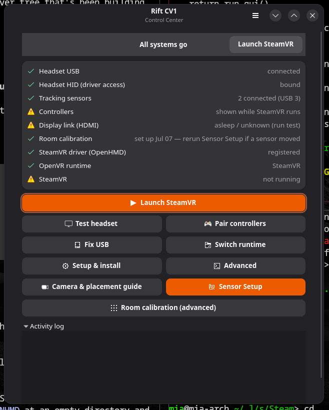
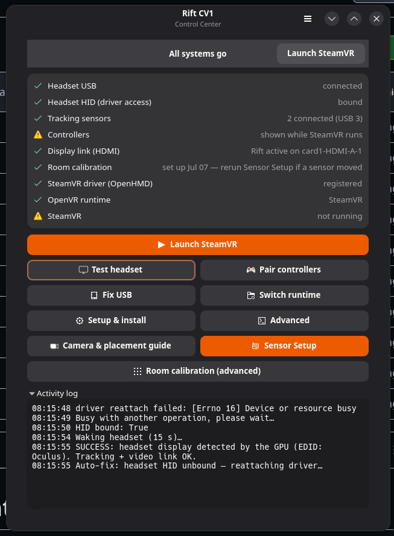
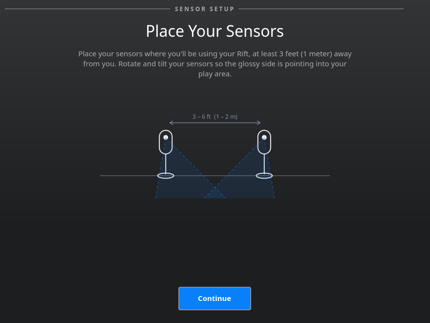
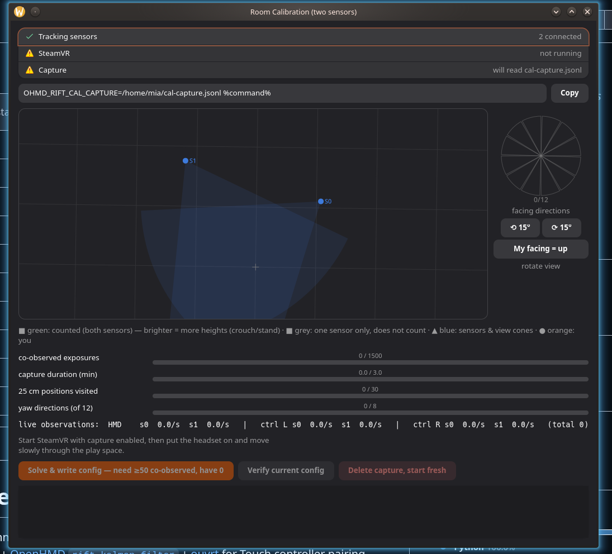
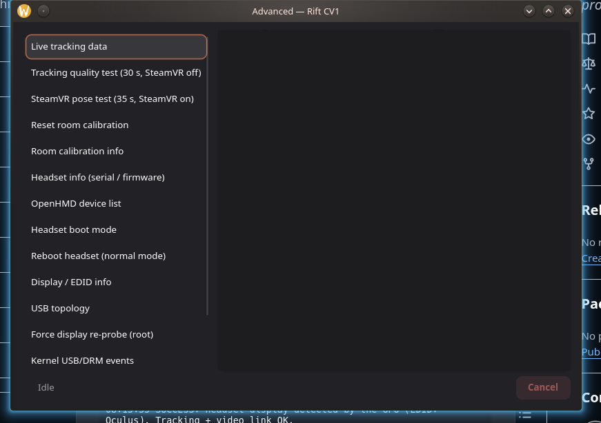

# Rift CV1 Control Center

GTK4/libadwaita control center for running an **Oculus Rift CV1** on Linux
with SteamVR, wrapping the OpenHMD stack:
[SteamVR-OpenHMD](https://github.com/ChristophHaag/SteamVR-OpenHMD) +
[OpenHMD `rift-kalman-filter`](https://github.com/thaytan/OpenHMD) +
[ouvrt](https://github.com/pH5/ouvrt) for Touch controller pairing.

This repo is **self-contained**: the driver features the calibration
stack needs (room config with static sensor poses, the calibration
capture hook, the OVR-style fusion port) ship as `patches/`, which
**Setup & install** applies automatically on top of pinned upstream
commits. You do not need any pre-modified checkout.

## Screenshots

| Control center | Wake test & activity log |
|---|---|
|  |  |

| Sensor Setup (Oculus-style wizard) | Room calibration (advanced) |
|---|---|
|  |  |



## Getting started

1. Install the build dependencies (the Setup dialog shows the exact
   command for your distro — pacman/apt/dnf); the GUI needs PyGObject
   (GTK4 + libadwaita) from your distro, plus Steam with SteamVR.
2. Run the GUI (`python3 rift_cv1_center.py`), open **Setup & install**,
   click *Install / update everything* — clones + patches + builds
   SteamVR-OpenHMD/OpenHMD and ouvrt, installs udev rules (asks for
   auth), registers the driver.
3. Plug in headset and 1–2 sensors (motherboard USB 3 ports, no hub),
   then run **Sensor Setup** and follow the wizard.
4. Launch SteamVR.

## Features

- **Status card**: headset USB/HID, tracking sensors (count + USB-3 link
  check), controller battery (while SteamVR runs), HDMI link, room
  calibration, driver registration, OpenVR runtime, SteamVR — with a smart
  suggestion banner and an optional USB-wedge auto-fix.
- **Wake test** — verifies tracking + display link end to end.
- **Fix USB** — driver reattach, then USB reset, for the "HID not bound
  after the headset reboots itself" wedge.
- **Touch pairing wizard** — reboots the headset radio into pairing mode via
  ouvrt, bonds both controllers, reboots back automatically.
- **Sensor Setup** — a 1:1 recreation of the Windows Oculus app's CV1
  sensor setup (same page order, titles, copy and dark look, extracted
  from the real client): sensor connection check, placement guidance,
  height entry, a "move the headset" tracking capture that solves the
  sensor extrinsics, and a "stand at the centre" confirm step (with the
  Oculus distance checks) that anchors floor / centre / forward and
  writes `rift-room-config.json`. See CALIBRATION.md.
- **Room calibration (advanced)** — live monitor for the offline
  bundle-adjustment cycle (see CALIBRATION.md): capture detection,
  per-sensor observation rates, coverage progress with hints, and
  solve/verify with streamed output. Use it for maximum accuracy after
  Sensor Setup, or to re-verify an old calibration.
- **Tracking convergence check** (menu) — the old guided calibration:
  optical convergence check plus standing centre/floor through the
  Chaperone API. Also available headless as `calibrate`.
- **Runtime switching** between SteamVR and WiVRn (xrizer).
- **Camera view & placement guide** — live sensor debug stream (PipeWire)
  with placement diagrams for play, calibration, pairing and testing.
- **Advanced tools** — tracking quality test, in-SteamVR pose test, room
  calibration info/reset, headset serial/firmware info, EDID/USB/kernel/log
  inspection, diagnostics export.
- **Setup & install** — clones and builds the whole stack, installs udev
  rules, registers the driver, adds a desktop entry.

## Usage

GUI:

```sh
python3 rift_cv1_center.py
```

CLI (scriptable, no GUI/GTK needed):

```sh
python3 rift_cv1_center.py status            # exit code 1 if something is wrong
python3 rift_cv1_center.py fix-usb
python3 rift_cv1_center.py test              # wake test (15 s)
python3 rift_cv1_center.py calibrate         # guided full tracking calibration
python3 rift_cv1_center.py switch-runtime steamvr
python3 rift_cv1_center.py room [--reset]
python3 rift_cv1_center.py info | devices | export
```

## Configuration

Defaults assume the stack lives in `~/git/`. Override any path via
`~/.config/rift-cv1-center/config.json`:

```json
{
  "steamvr_openhmd": "~/src/SteamVR-OpenHMD",
  "ouvrt_dir": "~/src/ouvrt",
  "steamvr_path": "~/.local/share/Steam/steamapps/common/SteamVR",
  "steam_logs": "~/.local/share/Steam/logs",
  "openhmd_config": "~/.config/openhmd"
}
```

or environment variables (`RIFT_CV1_STEAMVR_OPENHMD=…` etc.), which take
precedence.

## Layout

```
rift_cv1_center.py    entry point (GUI or CLI)
calibrate_room.py     calibration solver (setup / solve / verify / coverage)
patches/              vendored driver patches (applied by Setup & install)
riftcv1/
  config.py           paths & constants (+ config file / env overrides)
  hw.py               USB sysfs, hidraw, EDID, USB reset/reattach
  runtime.py          openvrpaths, runtime switching, SteamVR device query
  install.py          build/install steps for the stack
  diagnostics.py      one-shot diagnostic tools & report export
  cli.py / gui.py     the two frontends
  pairing.py          ouvrt DBus + Touch pairing wizard
  calibrate.py        full-calibration flow logic (optical + Room Setup)
  calwizard.py        GTK wizard driving calibrate.py
  sensorsetup.py      Oculus-style Sensor Setup wizard (calibrate_room.py setup)
  roomcal.py          two-sensor room-calibration monitor (calibrate_room.py GUI)
  camview.py          sensor camera stream + placement guides
  pose_test.py        in-SteamVR pose stability test (runs in the venv)
  vrinfo.py           SteamVR device/battery query (runs in the venv)
  roomsetup.py        standing centre/floor via Chaperone API (venv)
```

The `openvr` Python bindings live in a private venv (created on first use
of the pose test) — either `./venv` or
`~/.local/share/rift-cv1-center/venv`.
